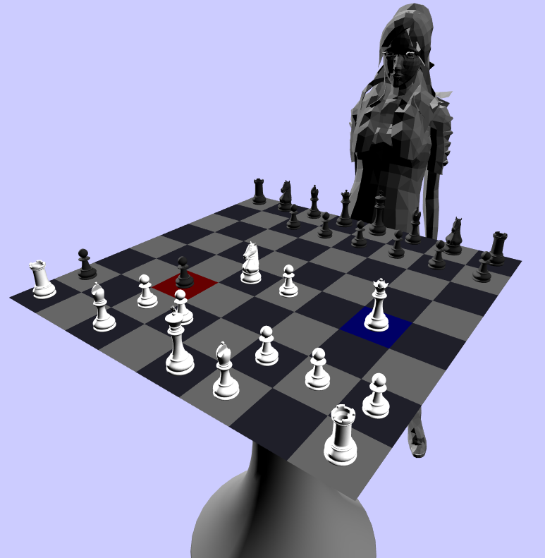

**3D chess program in OpenGl and C**

- compile: make
- run: ./chessboard

Move around the chessboard using the keys:

                            .---- forward
              camera down - q w e --- camera up
                   left --- a s d --- right
                              '
                              `---- backward

Highlight cells:

                              .---- forward
                              t
                   left --- f g h --- right
                              '
                              `---- backward

Select pawn: p

Tested on MacOSX 10.6.8

